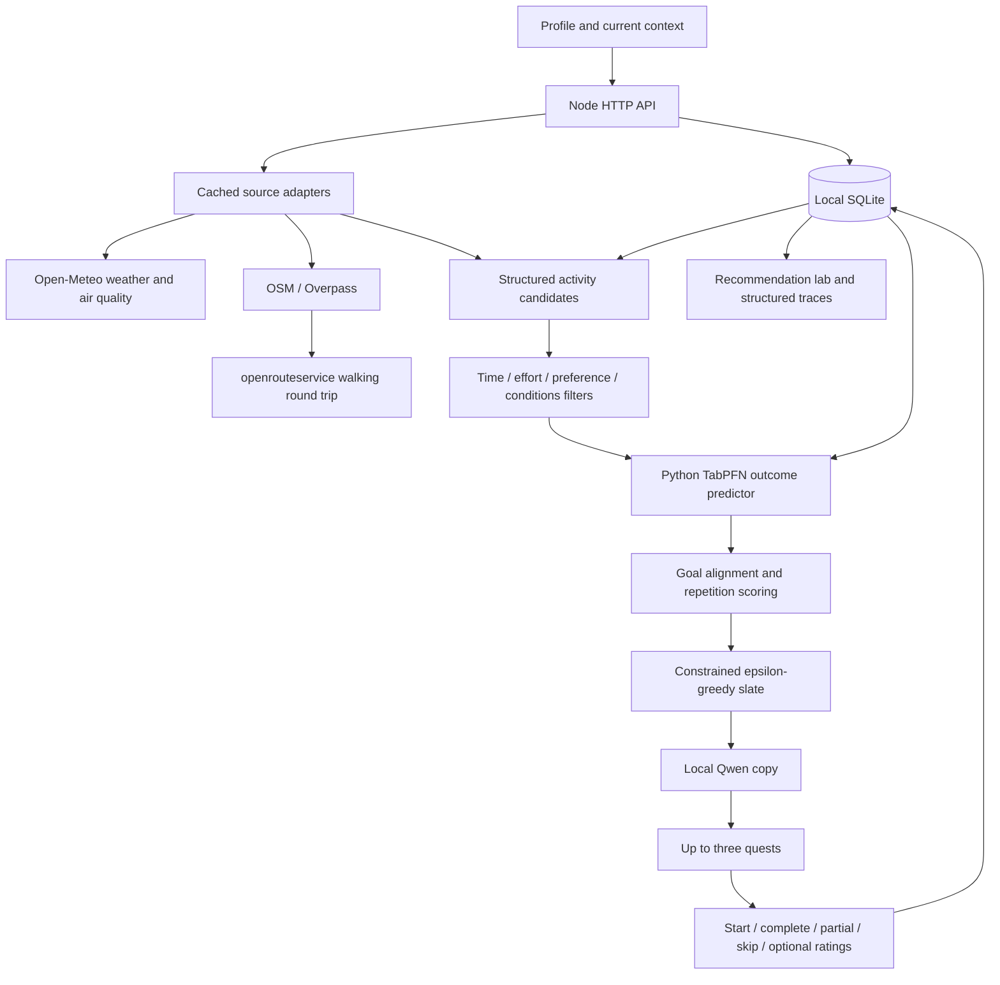

# Architecture

## Recommendation Flow



Node owns storage, source routing, candidate eligibility and final selection. TabPFN estimates outcomes. Qwen supplies language; it cannot change the saved activity facts. Neither model is a database.

## Single-Service Deployment

The Docker image packages Node, CPU Ollama/Qwen and Python/TabPFN in one service. `deploy/entrypoint.py` prepares writable disk/cache directories and starts Supervisor as PID 1. All application processes run as `outbound`; Supervisor restarts long-running workers, forwards output and terminates their process groups on shutdown. Only Node binds to `0.0.0.0:$PORT`; Ollama binds to `127.0.0.1:11434` and Uvicorn to `127.0.0.1:8008`. No external inference service is needed.

`deploy/bootstrap.py` is a supervised background initialization job. It pulls/warms the configured Qwen model and runs `deploy/prefetch_tabpfn.py` to cache the exact v2 classifier used by the ranker. A successful checkpoint download is not a successful holdout evaluation. Failed initialization retries; structured status is atomically written to `/tmp/outbound-models.json` and included in `/api/status`. That file is an initialization snapshot; reachability checks describe current model services. The separate `/healthz` checks web liveness without waiting on model initialization.

One persistent mount at `/var/data` holds SQLite and both model caches. `.dockerignore` is an allowlist that excludes local secrets, personal databases, models and development artifacts. CPU-only Torch avoids unused CUDA packages; Ollama's GPU payload directories are omitted from the final image. One Ollama request/model, a bounded context, one serialized Python ranker and a configurable fitted-estimator cache limit reduce concurrent memory pressure. Model request deadlines can be raised within a two-minute bound for CPU inference. Actual peak RAM/latency must still be benchmarked on the target instance.

## Persistence

`backend/store.mjs` creates a versioned SQLite schema using Node's native driver. WAL, foreign keys and a busy timeout are enabled.

| Table | Purpose |
| --- | --- |
| profiles | Editable profile JSON, local workspace ID, migration marker |
| recommendations | Context snapshot, source provenance, every scored/rejected candidate, policy decisions, selected quests |
| attempts | Structured status/ratings/minutes, authoritative quest/context snapshot, recommendation link, synthetic marker |
| events | Timestamped stage, run ID, severity and JSON payload |
| source_cache | Provider, normalized request key, response data and expiry |

Flexible documents use JSON columns; queryable outcome fields have dedicated columns. Each table is scoped by workspace except the shared provider cache. Demo workspace IDs are derived server-side from the session, never accepted from the caller.

A random persistent HttpOnly, SameSite=Strict cookie is the local workspace capability. API responses are not cached, and cross-origin writes are rejected. HTTPS deployments use secure cookies and the configured public origin (Render's URL by default). This is not production authentication. Local Node defaults to localhost; Docker exposes Node and requires operational access controls for public use.

The bootstrap endpoint imports valid legacy browser attempts once, in a transaction. Later refreshes read SQLite instead of reimporting stale browser state. Feedback uses the saved started attempt, so a caller cannot replace its quest or context. Feedback retries update the same row.

Unselected quests have no outcome labels. Started-but-unfinished quests are stored for inspection and excluded from model history. Partial and skipped are distinct statuses; full completion is the current binary prediction target. Enjoyment and benefit can be null.

## Specialist Adapters

The backend routes sources deterministically rather than letting the LLM choose arbitrary tools:

- No location: use templates and personal history; skip location-dependent calls.
- Area/city location: fetch weather and air quality only.
- Current coordinates: also query a bounded Overpass radius, then route up to three destinations.
- Missing/failed routing: do not create named destination quests with guessed travel time.

Weather uses current conditions and hourly values overlapping the outing. Air quality comes from modeled AQI. Place queries exclude explicitly private/no-access/no-foot entries. Routing uses a pedestrian origin-destination-origin request. Duration includes travel, activity and a small return buffer.

Provider requests have five-second deadlines, with up to two ten-second attempts for the shared Overpass service. The standard public instance can fail over to Private.coffee on network/server failures; 4xx responses are not retried. Custom endpoints have no automatic public fallback. Concurrent identical queries share a promise; failed place queries have a 30-second retry cooldown. Cache TTLs are weather 10m, air 30m, places/routes 24h and geocoding 7d. Source statuses are `live`, `cached`, `skipped`, `not_configured`, or `unavailable`. Failed requests are not cached as valid data.

OSM coverage, access tags, route endpoints and opening hours may be incomplete. Estimates do not establish real-time access or safety. Thunderstorms, heavy modeled precipitation, strong wind, extreme apparent heat and very poor AQI suppress candidates. These checks are not a comprehensive hazard assessment.

## Candidate Generation and Scoring

The versioned catalog in `backend/catalog.mjs` contains 120 distinct activities, 20 per category. Each has a stable ID, minimum/maximum total time, physical/social effort, preparation, and any daylight/dry-ground requirements. Minimum time is never silently shortened. Real destinations add candidates only when a walking estimate fits the available time. Qwen is called after selection, so its inference does not grow with the entire candidate pool.

`backend/place-matching.mjs` supplies explicit compatibility rules for green spaces, libraries, sports grounds and shops/markets. Shopping matches and book returns require a supported explicit need in the current note. Ball practice requires a mapped supported sport. These rules do not establish access, facilities or stock. A library reading match stays outdoors and requires a permitted spot on arrival.

Routing selects up to three destinations, prioritizing the current goal or manual activity pick and different place groups before more similar venues. Up to 12 feasible activities per routed place are considered in category-balanced order. An activity compatible with several places keeps the shortest verified walking round trip. Local variants preserve the original template ID; there are at most 120 generic plus 120 unique local variants, within the ranker's 256-row bound.

Named destination candidates reserve two minutes beyond travel and on-site activity. The catalog minimum is conservatively required as the minimum on-site duration. Travel is not guessed when a route is unavailable. `place_match`, destination uncertainty flags, timing components and per-place matching diagnostics are saved with the recommendation. `route_selection` and `place_matching` events expose the decision without printing coordinates or the raw user note.

Filtering considers available time, physical/social comfort, low energy, supported explicit note constraints, dislikes, darkness for destination quests, and severe available conditions. Arbitrary natural-language constraints are not fully understood; the small explicit matcher is intentionally limited.

TabPFN returns completion and enjoyment estimates for every eligible candidate. The backend computes:

```text
score = 0.40 * completion_probability
      + 0.35 * liked_probability
      + 0.25 * goal_alignment
      + place_fit_bonus
      + mood_fit_bonus
      - repetition_penalty
```

Goal alignment is a rules-based signal, not an inferred causal benefit. A stable template ID receives a 0.15 penalty if attempted among the last 12 feedback rows, plus 0.08 if displayed in the last eight recommendation slates. Display history is read separately from outcome labels: an unchosen quest is not counted as a failure. The weights are initial product settings, not scientifically established optima.

Place fit adds 0.04 only for a verified-route/catalog match whose activity type aligns with the selected goal or supported profile hobby. This is a bounded product heuristic, not a model prediction or causal estimate. TabPFN sees the actual travel and total duration through its existing features; it does not receive exact destination coordinates.

Mood fit adds 0.06 for supported rule-based category/effort matches. Tired/anxious settings favour gentle, low-social activities; restless favours movement; bored/curious favour noticing and creative activities. These are inspectable preference rules, not clinical judgments. Intent and verified-destination gates apply to generic candidates too, so the generic catalog cannot bypass an unrequested book return or invent a nearby garden.

The first slot favours low-effort, nonsocial activities. Subsequent slots favour different categories when available. Within each eligible pool, recently displayed activities are excluded when alternatives remain. Exploitation samples uniformly among candidates within 0.02 of the highest score, avoiding catalog-order bias. The third slot uses epsilon=0.15 to explore among the least-tried remaining categories. If the user picks a library activity, the first slot is reserved for it only after all safety/time filters pass; its conditional probability is 1. The lanes are presentation labels, not a promise that the third activity is physically harder.

Candidates for an already chosen template or named destination are excluded from subsequent slots. This prevents a local activity and its generic version appearing together, or three nominally different tasks at the same place.

When feasible named candidates remain in the first slot's pool, they are preferred before applying novelty and score sampling. The conditional pool and `locationPreferred` decision are logged. Darkness, route availability and time constraints are never bypassed to fill this slot. `destinations` records mapped/routed/eligible counts and exclusions independently of successful source requests.

Each slot stores its conditional candidate pool, exploitation/exploration pools, novelty decision, epsilon, choice and selection probability. For automated choices, probability is `(1-epsilon)/exploitation_pool_size` if the chosen candidate belongs to that pool, plus `epsilon/exploration_pool_size` if it belongs to the exploration pool. These probabilities describe the algorithm's display decision, not the user's probability of choosing or benefiting from a quest. Observational feedback and user self-selection limit causal evaluation.

## TabPFN Service

`POST /rank` accepts at most 500 historical rows and 256 candidate rows. All eligible catalog activities are predicted in one batch. Feature columns are:

```text
minutes_available, mood_before, energy_before, goal_type,
locality_type, weather, temperature, rain_probability,
quest_type, quest_duration, travel_minutes,
physical_effort, social_effort
```

Only values available before the attempt are features. Outcome labels, notes, IDs and benefit ratings are excluded. The Node request excludes coordinates and raw notes.

Completion and enjoyment are separate classifiers. Each target ignores missing labels and requires varied outcomes. The service uses the pinned v2 checkpoint, native categorical features, batched inference, a bounded fitted-estimator cache and a lock around model work.

Once enough history exists, the earlier rows train an evaluation estimator and the last 20% (at least eight rows) form a chronological holdout. Brier scores compare TabPFN with a smoothed category-frequency baseline. A target uses TabPFN only if it wins this check, then fits on all labeled history. Otherwise its baseline stays active.

This small holdout is an initial deployment gate, not a reliable estimate of long-term performance. Repeated inspection can overfit the gate; larger prospective evaluation is needed as real feedback grows.

Response mode is `baseline`, `hybrid`, or `tabpfn`, with per-target label counts, reasons and evaluation. Import success or a token alone never counts as successful inference. Startup/import may take time; first fit may download weights. Node falls back after a 12-second prediction deadline.

## Qwen and Voice

Ollama receives the profile, relevant recent notes and selected activities. A JSON schema constrains the copy response. All original IDs must match, and text fields have length limits. Only title, why and reflection prompt are accepted; factual steps, destinations, timings and preparation are preserved. Model failure, timeout or invalid output uses template copy.

`backend/explanations.mjs` builds the final `why` and structured `evidence` from saved settings, score components, historical counts, relevant notes and source facts. Qwen's proposed explanation is not used as factual evidence, and named destination titles are retained. Generated generic titles and reflection prompts are still imperfectly checked free text. Supported preparation reminders are extracted conservatively from the latest relevant note; they do not fine-tune model weights.

ElevenLabs is independent of ranking and optional. Local reward sounds and browser speech remain available. Any voice or transcription request sends its payload to that provider.

## API

| Method | Route | Purpose |
| --- | --- | --- |
| POST | /api/bootstrap | One-time legacy import; load authoritative profile/history |
| POST | /api/profile | Validate and persist profile |
| POST | /api/generate | Recommend using stored personal history |
| GET | /api/activities | Full browsable 120-activity catalog |
| POST | /api/attempts/start | Persist selected quest and authoritative context |
| POST | /api/feedback | Save optional ratings and complete/partial/skip |
| GET | /api/lab?scope=demo\|live&page=0 | Paginated attempts, counts, latest run and events |
| POST | /api/demo/seed | Replace 20-200 synthetic demo attempts |
| POST | /api/demo/recommend | Execute full pipeline on demo history |
| POST | /api/location | Area geocoding through Open-Meteo |
| POST | /api/location/reverse | Cached ORS/Pelias area name for a selected pin or GPS point |
| POST | /api/location/conditions | Cached weather/AQI preview for the selected point; no routing |
| GET | /api/status | Database/source/model configuration and service health |
| POST | /api/context | Legacy optional SerpAPI query; not part of recommendations |
| POST | /api/reward | Friendly reward copy |
| POST | /api/speak | Optional ElevenLabs speech |
| POST | /api/transcribe | Optional ElevenLabs note transcription |

## Observability and Demo Data

Each run records request, source, candidates, prediction, selection, writer, grounded explanation and completion events. Profile/migration/start/feedback/seeding and conditions-preview events are recorded too. The latest 1,000 events per workspace are retained. Terminal output is structured JSON and excludes notes, keys and precise coordinates. SQLite contains personal notes and location snapshots locally.

The lab shows source status, target engines, validation, score components, rejected candidates, policy choices and saved rows. Synthetic history is deterministic and explicitly marked. It demonstrates the pipeline without counting toward real achievements or establishing model effectiveness.

## Open Components and Offline Boundaries

SQLite, the application code, the local model runtime and specialist source tooling can be inspected and changed. Qwen and TabPFN run locally; checkpoint-specific licenses apply. Replacing the predictor does not require replacing persistence or the UI.

Network access is needed for fresh external facts and first-time downloads. Cached facts and template activities remain available when those providers fail. Location providers receive query coordinates, while profile notes stay local unless the user invokes an optional hosted voice/transcription service.

The map picker debounces reverse lookup and rejects stale responses. Area names and optional user aliases are separate fields in the location snapshot; the main view and lab use the same display formatter. Failed geocoding falls back to coordinates, never an invented place name. The ORS key stays on the backend and is sent in an authorization header, not a browser URL.
