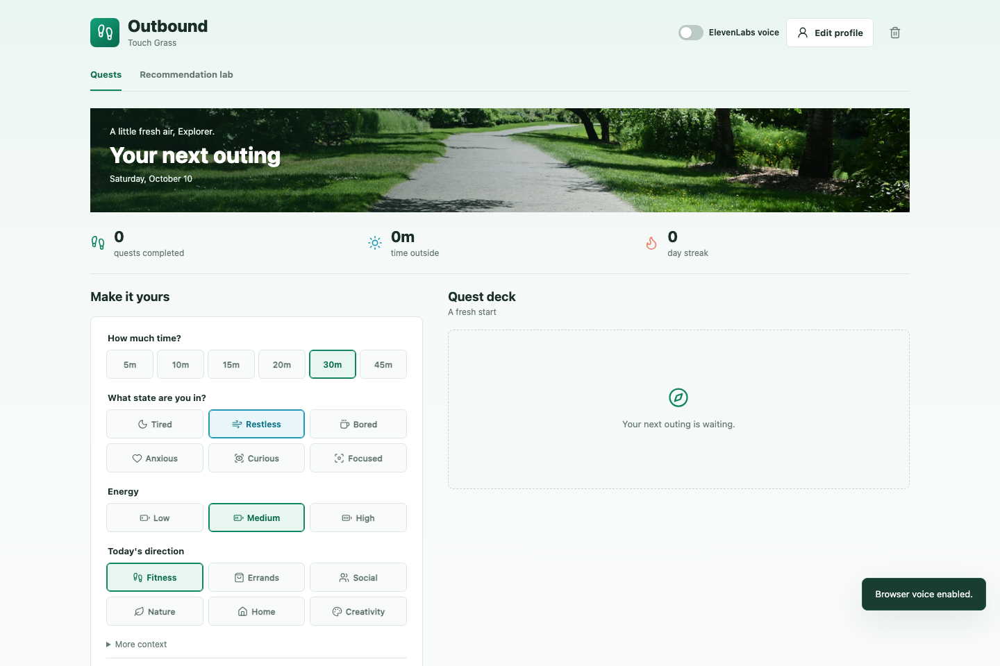
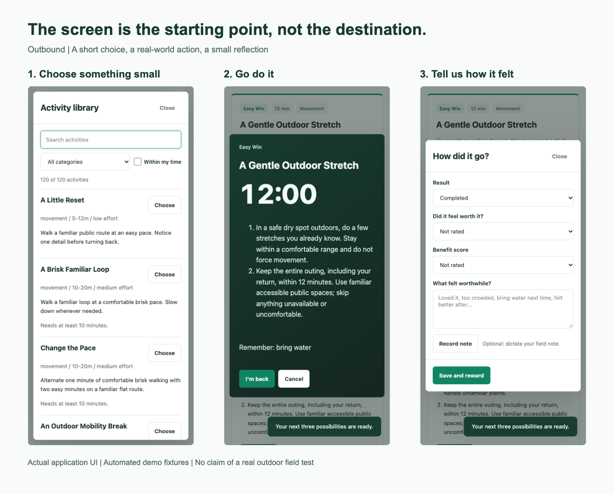
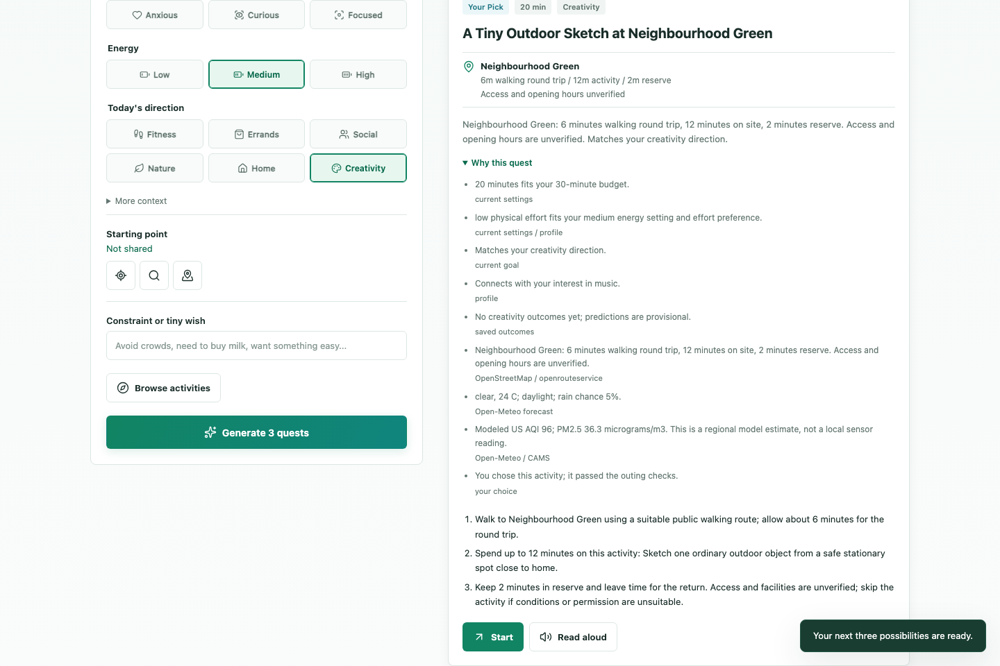
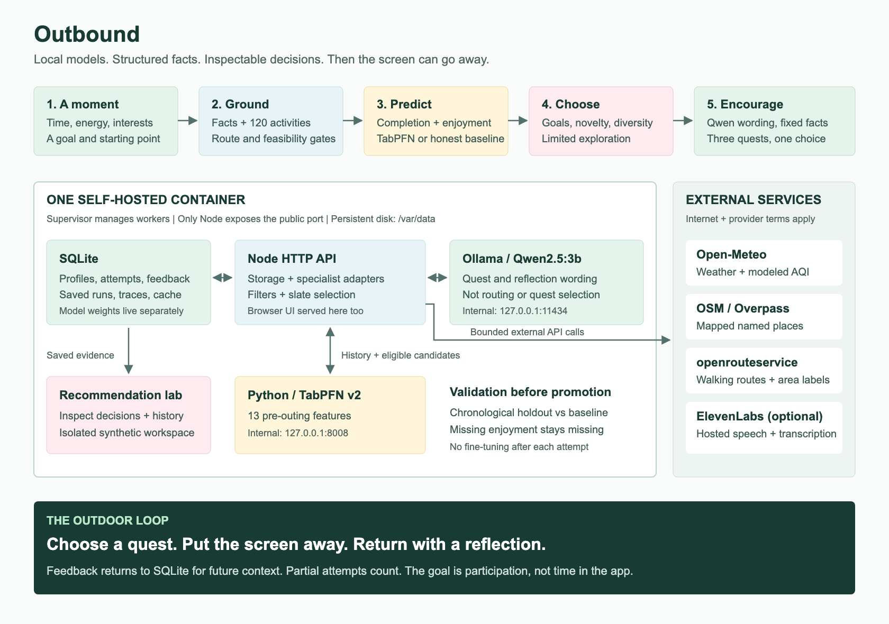
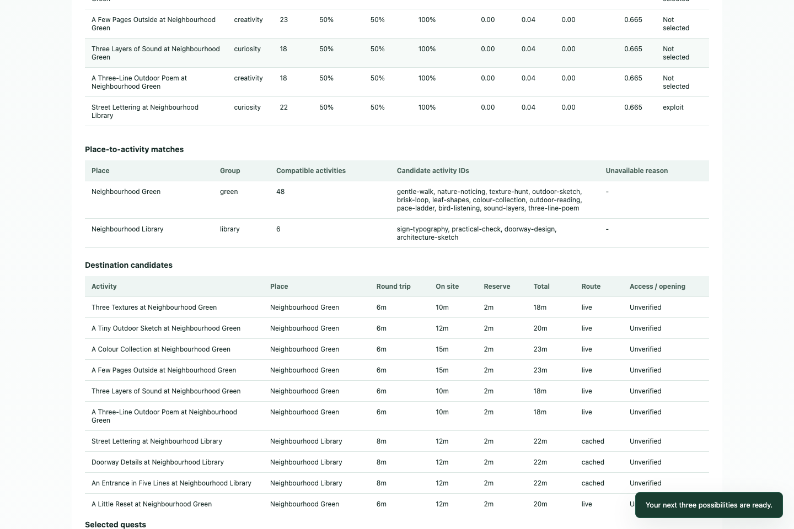

*This is a submission for the [Hacktoberfest Open-Source AI Challenge Week 1: Touch Grass](https://dev.to/challenges/hacktoberfest-week1-2026-10-05)*

## What I Built

🌱 **What if an app's best outcome was that you stopped using it?**

That is the idea behind **Outbound**: a small, gamified outdoor quest app built around local, open-weight AI. Not an infinite feed. Not another chatbot to keep talking to. Just a little help choosing something worth doing in the real world.


*Figure 1. A starting point, not a destination: the actual Outbound interface with automated demo state.*

You start with interests, goals, things you dislike, and a few practical reminders. Before an outing, you tell Outbound how much time you have, how you feel, your energy level, and optionally your starting point.

🎯 **It gives you three possibilities. You choose one. Then you can put the phone away.**

The activities range from gentle movement and noticing nature to tiny creative exercises, low-pressure social activities, and useful errands. There are **120 distinct catalog activities**, not 120 rewrites of “go for a walk.”


*Figure 2. Choose → go do it → reflect. These are automated UI fixtures, not photographs or evidence of a completed outdoor trip.*

On return, you can mark the quest complete, partial, or skipped; optionally say whether it felt worthwhile; and leave a short note. “Bring water next time” can become a future preparation reminder. Missing ratings stay missing rather than becoming dislikes.

🏅 **The rewards acknowledge participation.** Badges include First Step, Three Real Days, Curiosity Engine, Screenbreaker, and Partial Counts. Local sounds celebrate progress. Optional ElevenLabs read-aloud and reward speech add a friendly voice, while typed notes and browser speech remain available.

This is for the person who thinks, “I should get outside,” but gets stuck choosing what to do. Someone with fifteen minutes and low energy deserves a useful option too.

> 📱 The design goal is not more time in Outbound. It is less friction before doing something outside.

## Demo

🚀 **[Try Outbound](https://outbound-taqn.onrender.com/)**

To explore the full decision trail without affecting your own progress, open **Recommendation lab**, seed the separate demo workspace, and run a recommendation. The lab distinguishes synthetic examples from personal outcomes.


*Figure 3. Named destinations include travel, activity time, and a reserve. “Neighbourhood Green” and the displayed source readings are controlled visual-test fixtures, not live place-discovery evidence.*

🗺️ **A destination is earned by the data, not invented by the language model.**

For an illustrative 30-minute outing, a six-minute walking round trip, twelve-minute sketch, and two-minute reserve total twenty minutes. That fits. A garden with a 28-minute round trip does not fit a fifteen-minute outing, however attractive the model could make it sound.

No precise starting point, no usable route, insufficient time, or after-dark exclusions? Outbound can offer suitable location-independent catalog activities instead. It does not attach a made-up garden or guess a walking time.

⏳ This is a CPU-hosted prototype. Cold models and busy public map services can make generation slow. Opening hours, facilities, and access remain unverified; check conditions yourself before setting out.

## Code

💻 **[Source, setup, and architecture on GitHub](https://github.com/Sahil-Jaiswal-189/Outbound)**

```bash
git clone https://github.com/Sahil-Jaiswal-189/Outbound.git
cd Outbound
npm install
cp .env.example .env
npm start
```

This starts the local web app. The README includes the additional Ollama/TabPFN setup and a single-container option that runs Node, both model services, and SQLite together. Credentials belong in `.env` or the hosting dashboard, not in Git.

## How I Built It

🧩 **Two models, a transparent selection policy, and clear responsibilities.**


*Figure 4. Self-hosted inference and storage are separate from external weather, map, route, and optional voice services.*

### 🗃️ SQLite remembers; it does not predict

SQLite stores the editable profile, context snapshots, saved recommendations, attempts, feedback, source cache, and structured events. Feedback refers to the saved quest rather than accepting replacement facts from the browser.

Unchosen activities are not failures. Started-but-unfinished activities do not silently become training labels. Partial attempts keep their own status, even though the current completion classifier specifically predicts full completion.

### 🌦️ Specialists provide facts

The Node backend calls structured sources directly:

- **Open-Meteo:** outing weather and modeled air quality.
- **OpenStreetMap / Overpass:** named nearby places.
- **openrouteservice:** pedestrian round-trip estimates and area names.

Leaflet supplies the map interface. Overpass discovers places; ORS checks routes. Qwen does neither. Source calls are deterministic adapters, not an autonomous tool-calling agent.

A catalog/place matcher builds appropriate activities at supported destinations. Filters then consider time, effort, preferences, explicit supported constraints, weather, and daylight. A nearby shop alone is not a reason to invent a shopping need.

### 📊 TabPFN estimates outcomes, not destinations

The local Python service uses **TabPFN v2** to estimate two separate probabilities: full completion and enjoyment. Its thirteen pre-outing features include available time, mood, energy, goal, locality type, weather, activity type, duration, travel, and physical/social effort. Exact coordinates and raw notes are not predictor features.

Cold start uses a smoothed category baseline. Each target needs enough varied labeled data, including at least thirty earlier training examples and eight later holdout examples. TabPFN is promoted for that target only when its holdout Brier score is lower than the baseline's. One target can use TabPFN while the other remains on the baseline.

🔬 This is a preliminary quality gate, not proof that the app improves fitness or that small-sample probabilities are perfectly calibrated.

### 🎲 Selection balances relevance with variety

The recommendation engine combines outcome estimates with goal alignment, bounded mood/place bonuses, and repetition penalties. It creates a diverse slate, avoids recently offered activities when alternatives remain, and uses limited epsilon-greedy exploration in the third slot.

That policy is inspectable code, not a separately trained reinforcement-learning model. It records its candidate pools and conditional selection probabilities. The probabilities describe the app's selection, not a causal estimate of what an activity will do for someone.

### 💬 Qwen supplies warmth after the decision

**Qwen2.5:3b runs through Ollama.** It can customize friendly generic titles and reflection prompts after the engine selects activities. Named destination titles, factual steps, timings, and preparation are preserved. Final recommendation reasons are built from saved evidence rather than trusting an LLM-written explanation.

New feedback becomes context for future predictions and relevant reminders. **We do not fine-tune Qwen or TabPFN weights after every quest.**


*Figure 5. The lab makes the decision process inspectable. This screenshot uses a controlled visual fixture; actual model execution is checked separately.*

### 🛠️ A small reliability lesson

Public Overpass servers sometimes respond too slowly. The HTTP wait is now thirty-five seconds per endpoint, with fifteen seconds allowed for query execution. Existing bounded failover, request coalescing, a thirty-second failed-query cooldown, and a twenty-four-hour cache remain in place. This does not guarantee a response; failed lookups are reported honestly and do not become fabricated facts.

The all-in-one Docker image uses Supervisor, internal-only model ports, non-root application workers, and a persistent disk for SQLite and model caches. A web liveness check is deliberately different from model readiness.

✅ Verification covers **30 backend tests, 13 Python tests, and 26 desktop/mobile browser tests**. A separate container smoke check exercises real Qwen generation, actual TabPFN evaluation, worker restart, and persistence across redeployment. Synthetic tests validate mechanics, not real-world behavior change.

## Why Does Open Innovation Matter?

🔓 **The important freedom is being able to change what the system optimizes for.**

I can inspect the feature list, change the scoring weights, swap the predictor or local language model, and examine why a quest was selected. Outbound does not depend on asking a hosted chatbot to make an opaque recommendation and hoping the explanation is true.

🏠 **Local inference keeps the core under my control.** In laptop mode, profile/history storage and model execution stay on the laptop. In the container deployment, they stay on the server I operate rather than being sent to a hosted inference API. Once weights are downloaded, the model computations themselves can run without an internet connection; fresh weather, places, routes, and map tiles still need one.

🧪 **Open components let me use different tools for different jobs.** A small-data tabular foundation model estimates outcomes. An explicit policy selects a feasible slate. A local language model supplies wording. Neither model has to pretend to be a database, a map, or a safety authority.

💸 **There is no required hosted-model fee per recommendation.** That does not mean the whole app is free to operate: hardware, electricity, hosting, and optional ElevenLabs can cost money.

An important distinction: **open-weight does not mean unrestricted licensing**. This Qwen checkpoint uses the [Qwen Research license](https://huggingface.co/Qwen/Qwen2.5-3B-Instruct); the TabPFN v2 checkpoint uses the [Prior Labs License with attribution requirements](https://huggingface.co/Prior-Labs/TabPFN-v2-clf). Ollama is an open-source runtime. ElevenLabs is a separate proprietary, optional service. Coordinates still go to location providers, and enabled voice/transcription sends its payload to ElevenLabs.

That is where this approach fits better than a closed inference-only integration for my project: **control of the decision rules, deployment, and inspectable fallback behavior**, not a claim that these models outperform every closed model.

## My Agent Session

🤝 I built Outbound with an AI coding assistant, iterating on the catalog, local prediction service, source grounding, audio interactions, deployment, and tests. I do not have a shareable DevRelay recording, so there is no session embed here. The source and architecture document show the implementation; they are not a substitute for a recorded session.

## Prize Categories

- 📊 **Best Use of TabPFN:** local completion/enjoyment prediction, per-target chronological validation, and explicit baseline/hybrid/model modes.
- 🎙️ **Best Use of ElevenLabs:** optional quest read-aloud, friendly reward speech, and reflection transcription.
- 🚀 **Best Use of Render:** the supplied public demo is hosted on Render; the repository also packages the complete self-hosted runtime in one Docker service. The local container checks are not a claim about the currently deployed service's model readiness.

🌿 **The ambition is small on purpose: make one real-world action easier to choose today.**

No invented field-test story. No claim that badges solve habits. The next meaningful evaluation is taking the app outside and learning from genuine outcomes.

*Visual credits: the app's park-path photograph is by [Tina Devidze on Unsplash](https://unsplash.com/photos/a-path-winds-through-a-sunny-green-park-lh_MesNhkbI), under the [Unsplash License](https://unsplash.com/license). Screenshots show the actual app using automated fixtures; architecture and workflow figures were assembled for this write-up.*
